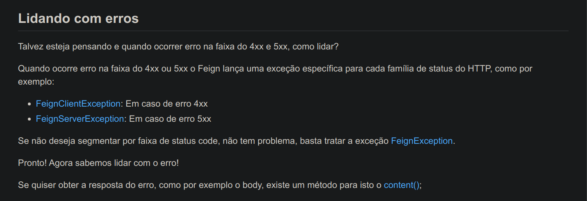
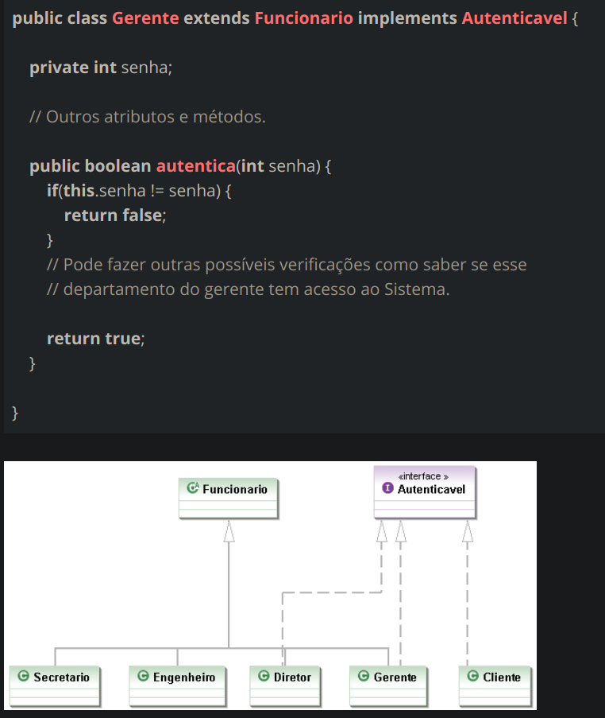
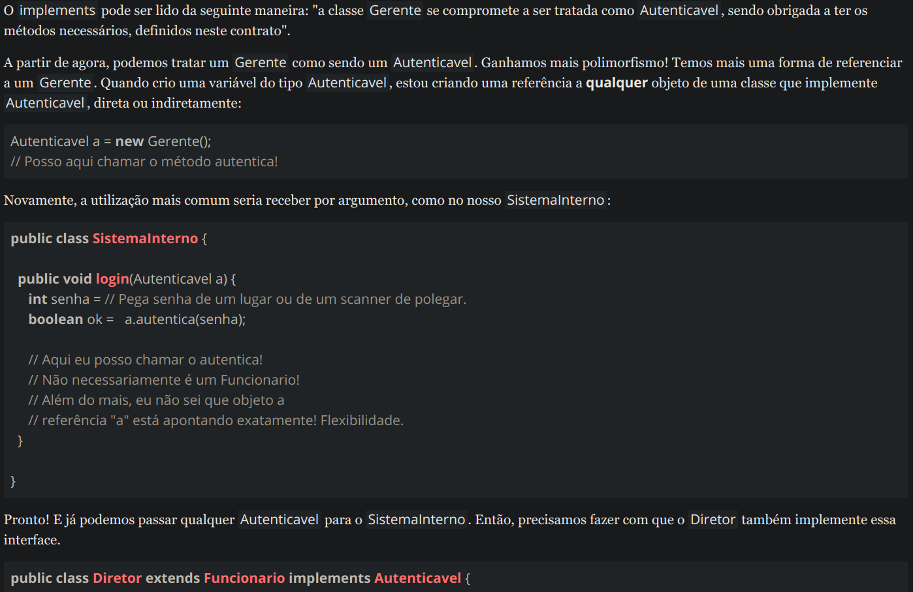
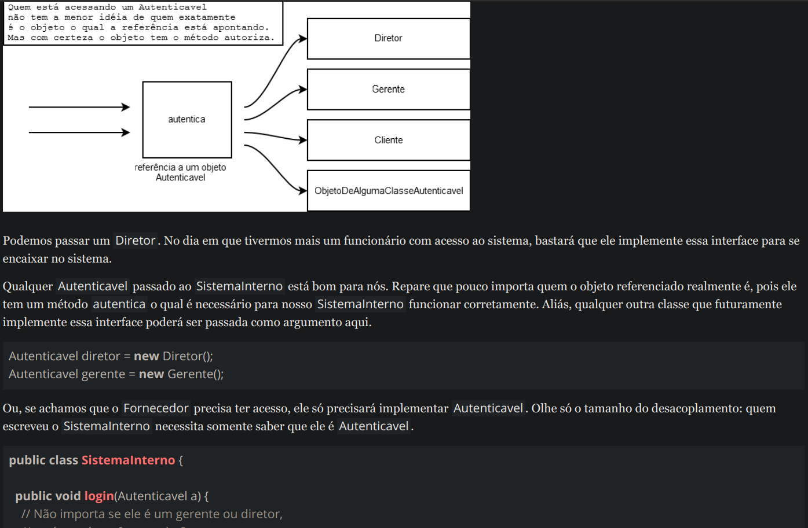
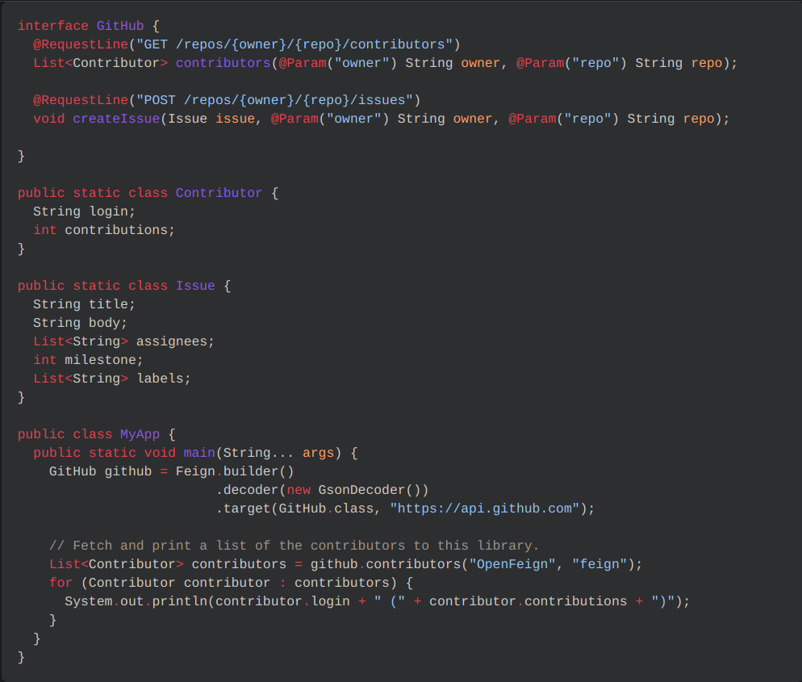
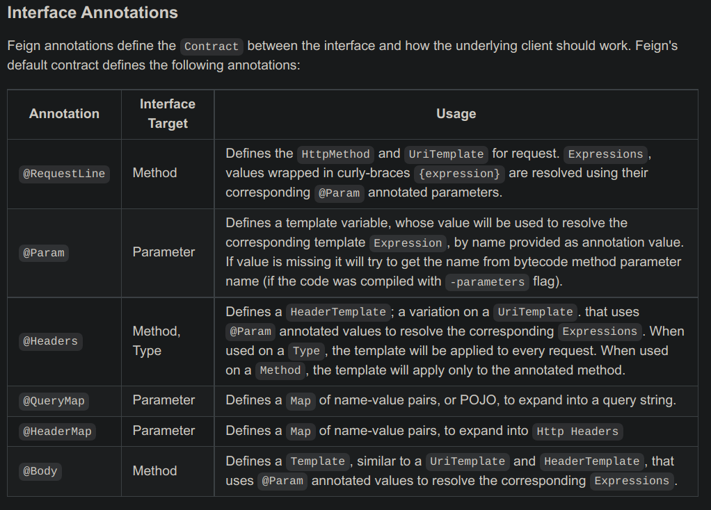

# Microsserviço de Propostas
### Orange Talents - Turma 8

- [x] 005.criacao_proposta
- [x] 010.nao_pode_haver_proposta
- [x] 015.consultando_dados_solicitante
- [x] 020.melhorando_visibilidade_healthcheck
- [x] 030.associar_cartao_proposta
- [x] 035.acompanhamento_proposta
- [x] 040.rodar_nossa_aplicacao
- [x] 045.criar_biometria
- [ ] 050.login_via_senha
- [ ] 055.bloqueio_cartao
- [ ] 060.notificando_legado_cartao
- [ ] 065.como_saber_tudo_funcionando_corretamente
- [ ] 075.aviso_viagem
- [ ] 080.notificando_sistema_bancario_viagem
- [ ] 085.associacao_paypal
- [ ] 090.associacao_samsung_pay
- [ ] 095.falhar_nas_chamadas
- [ ] 100.rodando_prometheus
- [ ] 105.dados_dos_clientes

### 005 - Criação Proposta (Caminho cognitivo)

Crio um controller com um método de verbo POST que recebe um form contendo os dados obrigatórios. Esse método é anotado
com @Valid e @RequestBody para segurança das informações sensíveis.
A classe form recebe anotações da bean validation para validar a entrada dos dados e garantir que eles cumpram as especificações
de obrigatoriedade. 
Crio uma anotation personalisada com as anotações @CPF e @CNPJ unindo as duas para que funcionem como uma única anotação
resultando em só uma notificação caso os dados não sejam válidos.

Crio a entidade usuário que será mapeada usando o Spring Data JPA e Hibernate para o relacionamento objeto relacional.
A classe form tem um método de conversão para Entidade, mas antes, ela busca no banco de dados checando se já existe um
cadastro do usuário em questão. Aí cabe uma anotação para validar se o cadastro é único ou se já foi realizado.

Voltando ao construtor, se estiver tudo ok, convertemos nosso form em entidade e usamos o Entity Manager para persistir 
os dados e depois, usamos o ResponseEntity<> para retornar uma classe DTO e um status ok caso haja sucesso ou 400 caso não.

### 010.nao_pode_haver_proposta

Crio uma anotação/interface que garanta a unicidade dos dados. Posso usar a anotação 
@Column(unique = true) também, mas queremos proteger as bordas do sistema.
Com a interface/anotação criada e configurada para retornar uma mensagem padrão, o field onde
ocorreu o erro e a classe a qual pertence o atributo validado.
Usamos uma classe validadora que implementa a ConstraintValidator. Essa classe é construída
de maneira agnóstica pois podemos reaproveitála em qualquer tipo de classe que precise ser
validada. Isso porque nossa classe validadora faz uso de Generics e de Criteria pra fazer
a busca no banco pelo documento enviado na request pelo cliente.
Caso o documento já esteja cadastrado, configuro o meu controller para retornar
HttpStatus.NOT_ACCEPTABLE que significa que o dado oferecido pelo cliente não é aceitável
nos parâmetros de nossa regra de negócio.

Para nos utilizar de boas práticas de REST API's, usamos um controllerAdvice para filtragem
de erros de retorno ao cliente.
Especificamos o nome da classe, o nome do field e a constraint que foi ferida (mensagem padrão).
Caso não exista nenhum documento cadastrado, retornamos 200 ok.

Sempre usarei o ResponseEntity como retorno de métodos de controllers.

## 015.consultando_dados_solicitante

Adiciono as dependências do OpenFeign ao projeto.
Crio uma interface anotada com @FeingClient com um método abstrato analizaProposta().
Esse método recebe uma proposta em formato Dto e devolve uma resposta da análise financeira.
Crio duas classes baseadas na documentação da OpenAPI via Swagger, a Solicitação da Análise que recebe uma proposta
via construtor e envia os parãmetros requisitados pelo WebClient. O mesmo WebClient me devolve um Resultado análise.
Adiciono o campo com o atributo do Enum de resposta do client (SEM_RESTRICAO, COM_RESTRICAO) à entidade Proposta.

No controller, passo o WebClient no construtor para inversao de controle.
Crio o método cadastraProposta que recebe uma proposta form para capturar os dados de requisição
do cliente.
Após, usamos um método de conversão para transformar o form numa Entidade mapeada pelo 
Hibernate. Usamos o EntityManager para persistir a proposta ainda sem o resultado de análise.
Pelo princípio de estados dos objetos, nossa entidade passa a ser gerenciada pelo JPA.
Crio um método dentro da classe proposta para fazer a requisição ao WebClient usando a proposta
como parâmetro.
Caso seja bem sucedida, o WebClient devolve uma resposta com o resultado da análise. No caso,
um Enum. Usamos um setter da entidade Proposta para setar o valor de statusDaProposta.
Caso seja mal sucedida, podemos devolver um FeignException.

Crio uma classe utilitária para gerar a URI de redirecionamento usando o 
id da proposta para exibir o resultado da análise da proposta.

Resumindo: Meu controller recebe uma requisição de Proposta, converte e 
mapeia a entidade, usa um controller cliente com o Feign para fazer uma
chamada à uma API externa enviando os dados da Proposta.
Ao receber a resposta, atualiza o campo de status da proposta na Entidade e
depois retorna um body com algumas informações e redireciona o path expan
dindo a URI com o id da proposta.
Se tudo der certo, devolve 201 created, se não, ele lança ou uma FeignException
ou MethodArgumentNotValidException que é tratado pelo nosso handler e controller
advice.

API externa de solicitação de análise de proposta

		uri=/api/solicitacao
		docker_image=zupacademy/analise-financeira
		
		 "NetworkMode": "nosso-cartao-compose_default",
            "PortBindings": {
                "9999/tcp": [
                    {
                        "HostIp": "",
                        "HostPort": "9999"
                    }
                ]
            },

		...

		"Env": [
                "SERVER_PORT=9999",
                "LOG_LEVEL=INFO",
                "URL_SISTEMA_CARTAO=http://contas:8888/api/cartoes",
                "JAEGER_ENDPOINT=http://jaeger:14268/api/traces",
                "PATH=/usr/local/sbin:/usr/local/bin:/usr/sbin:/usr/bin:/sbin:/bin",
                "SSL_CERT_FILE=/etc/ssl/certs/ca-certificates.crt",
                "JAVA_VERSION=11.0.6",
                "LANG=C.UTF-8"
            ],
            "Cmd": null,
            "Image": "zupacademy/analise-financeira",
            "Volumes": {},
            "WorkingDir": "/",
            "Entrypoint": [
                "java",
                "-cp",
                "/app/resources:/app/classes:/app/libs/*",
                "br.com.zup.academy.analise.financeira.AnaliseFinanceiraApplication"
            ],

		"Ports": {
                "9999/tcp": [
                    {
                        "HostIp": "0.0.0.0",
                        "HostPort": "9999"
                    },
                    {
                        "HostIp": "::",
                        "HostPort": "9999"
                    }
                ]
            },

		...

		 "Networks": {
                "nosso-cartao-compose_default": {
                    "IPAMConfig": null,
                    "Links": null,
                    "Aliases": [
                        "analise",
                        "2674fe5a1dc8"
                    ],

## What is the OpenAPI Specification?

The OpenAPI Specification (OAS) defines a standard, programming language-agnostic interface description for HTTP APIs, 
which allows both humans and computers to discover and understand the capabilities of a service without requiring access
to source code, additional documentation, or inspection of network traffic.

### Web Clients from Feign

[Feign Client](https://github.com/zup-academy/nosso-cartao-documentacao/blob/master/informacao_suporte/http-client-feign.md "WebClients com Feign")

## Um pouco sobre interfaces e Feign

## 020.melhorando_visibilidade_healthcheck

Primeiramente eu habilitaria e incluiria as dependências de monitoramento do spring-boot-actuator no pom.xml.
Depois, eu criaria uma classe que implemente a interface HeathIndicator anotada com @Component (bean do spring)

Vamos sobrescrever o método health que vai nos possibilitar capturar dados da aplicação por meio de endpoints providos pelo actuator.

Na nossa máquina local, usamos:
http://localhost:8080/actuator/health

e podemos observar os dados disponíveis fornecidos pelo actuator e pela nosso componente de health checking;
Criacao de endpoints que verifiquem a saúde e o estado de serviços internos e externos como
os endpoints de proposta e também o de análise de propostas.
Podemos usar o CORS que é uma especificação da W3C para estabelecer quem pode ter acesso aos
endpoints de health check para aumentar nossa segurança e expor só o necessário para usuários
autenticados. Podemos também configurar o tipo de informação que querermos.
O actuator nos dá vários endpoints com vários serviços. Não precisamos de todos por enquanto.
Provavelmente só os relativos a Readness Check como UP, DOWN, UNKNOW, etc...
Caso esteja tudo de pé, retornamos 200 ok, caso não, retornaremos algum Server Error 5XX

Caso seja pertinente, também posso instalar uma api de logs json based para auxiliar na exposição dos dados e inclusive no formato da apresentação como diferentes cores para diferentes grupos de logs, um prefixo pré-configurado para cada tipo de log ERR, INFO, SERV, TRACE, etc.

Ao definir os endpoints que serão observados, a estrutura do projeto com segurança, autenticação e acessos estabelecidos, preciso usar uma estratégia para otimizar meus logs a serem uma parte integrante de mais outro fluxo dentro da minha aplicação.

Algumas convenções serão seguidas como:

* Incluir um timestamp em cada log
* Em formato Json
* Com mensagens user friendly
* logs essenciais do que for significativo à minha aplicação
* E, em caso de logs ou tráfego de dados sensíveis, ofuscar as informações.

## 040.rodar_nossa_aplicacao

	mvn spring-boot:run -Dspring-boot.run.profiles=dev,local

_________________________________________________________________________

mysql:
image: mysql:5.7
ports:
- "3306:3306"
environment:
MYSQL_ROOT_PASSWORD: root
MYSQL_DATABASE: propostas
MYSQL_USER: root
MYSQL_PASSWORD: root
volumes:
- "db-data:/var/lib/mysql"
restart: on-failure
_________________________________________________________________________

proposta:
build:
dockerfile: Dockerfile
context: .
image: proposta
ports:
- "8080:8081"
environment:
MYSQL_HOST: mysql
MYSQL_PASSWORD: root
MYSQL_USER: root
MYSQL_DATABASE: propostas
MYSQL_PORT: 3306
URL_API_ANALISE_FINANCEIRA: http://analise:9999/api/solicitacao
URL_API_CARTOES: http://contas:8888/api/cartoes
KEYCLOAK_ISSUER_URI: http://keycloak:8080/auth/realms/propostas
KEYCLOAK_JWKS_URI: http://keycloak:8

https://www.webtutorial.com.br/como-instalar-o-mysql-usando-o-docker/

mysql:
image: mysql:5.7
ports:
- "3306:3306"
environment:
MYSQL_ROOT_PASSWORD: root
MYSQL_DATABASE: propostas
MYSQL_USER: root
MYSQL_PASSWORD: root
volumes:
- "db-data:/var/lib/mysql"
restart: on-failure

## 045.criar_biometria

Crio um controller pra receber um POST. Uso um form pra receber a requisição com os dados requisitados pela regra de negócio.
Uso a anotação @PathVariable pra receber o id do cartão via uri. A anotação RequestBody pra que a informação venha pelo corpo da
requisição (segurança)
Uso o UriComponentBuilder pra devolver um path de redirecionamento com o id do recurso criado após processar e salvar a request.
Crio uma classe DTO usando o spring validator para validar os dados.
Dentro da classe, crio um metodo de conversão de DTO para entidade.
Crio uma entidade usando as anotações do Hibernate para o mapeamento objeto-relacional.
Caso o identificador do cartão informado não exista, eu uso RequestException pra devolver um código http 404.
Anoto o método de cadastro de biometria pra devolver 400 caso algum dado obrigatório não seja informado com @ResponseStatus.

Caso tudo corra bem, uso um ResponseEntity pra devolver 200 ok com o resultado de cadastro realizado com sucesso e o redirecionamento da uri contendo
o id do recurso criado.

